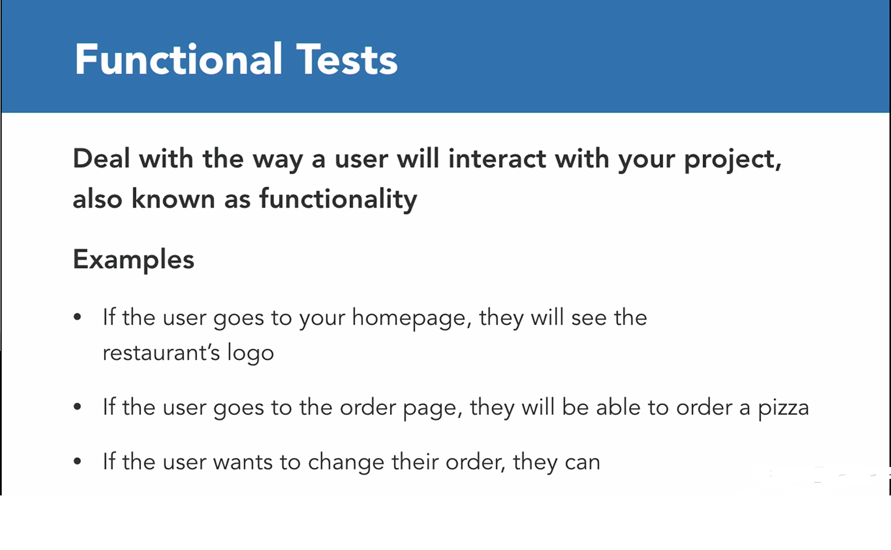
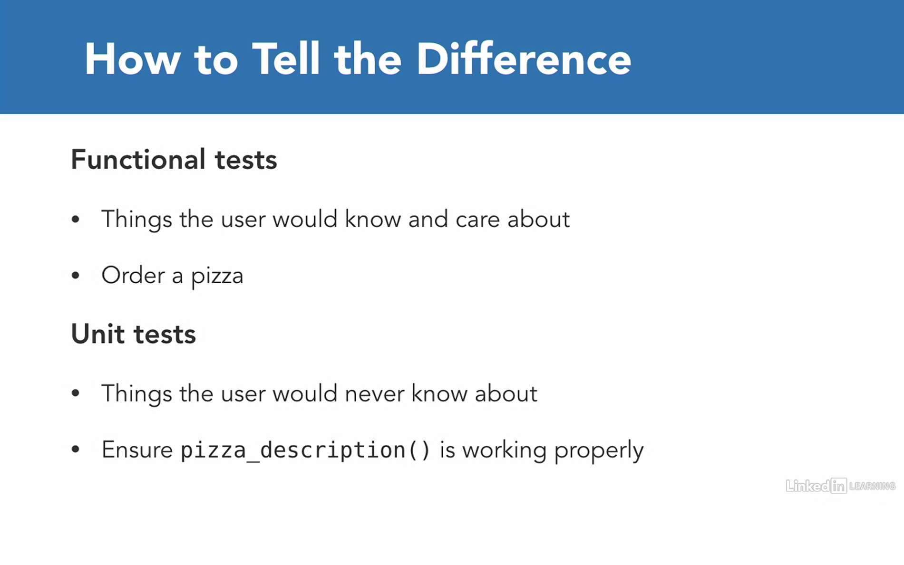

# Django Class Notes
Django Testing

### Nice to have VSCode Extentions:
- Djaneiro - Django Snippets  (Be carefull about other conflicting extentions!)

### Needs
- Python (add the path environment variable while installing)
- pip
- virtualenv
- selenium
- firefox browser (manually install) 
- geckodriver for firefox (install, unzip)

### Summary

- Django Testing Overview
- Spin up project
- Testing Example
- Hashing
- Functional test
  - Test homepage
  - Test sample hash result
- Unit Test
  - Test homepage
  - Test the form
  - Assertions
  - Test Models & Databases
    - Seperate testing database
  - Test the ability to see a hash on the page
- Combine Unit tests with functional tests
- Deployment testing
- TDD vs. Testing After
- Code Coverage
- Next steps

### Functional and Unit Tests






### Django Testing

[Testing in Django](https://docs.djangoproject.com/en/4.0/topics/testing/)

Automated testing is an extremely useful bug-killing tool for the modern Web developer. You can use a collection of tests – a test suite – to solve, or avoid, a number of problems:

- When you’re writing new code, you can use tests to validate your code works as expected.
- When you’re refactoring or modifying old code, you can use tests to ensure your changes haven’t affected your application’s behavior unexpectedly.

Testing a Web application is a complex task, because a Web application is made of several layers of logic:
- HTTP-level request handling, 
- form validation,
- processing, 
- template rendering. 

With Django’s test-execution framework and assorted utilities, you can simulate requests, insert test data, inspect your application’s output and generally verify your code is doing what it should be doing.

An easy [selenium](https://www.selenium.dev/selenium-ide/) functional test creation is possible, it's possible to record actions.


To dive deep into [selenium testing wiht python](https://selenium-python.readthedocs.io/getting-started.html)


# Spin up project
- (Optional) Shorten your powershell terminal prompt:
```sh
Function Prompt { "MyCode: " }
```
- Create a working directory, name it as you wish, cd to new directory
- Pull the latest changes from repo, copy materials, paste them to your newly created folder, or directly work on repo folder
- Create virtual environment as a best practice:
```py
python3 -m venv env # for Windows or
python -m venv env # for Windows
virtualenv env # for Mac/Linux or;
virtualenv env -p python3 # for Mac/Linux
```
- Activate scripts:
```bash
.\env\Scripts\activate  # for Windows
source env/bin/activate  # for MAC/Linux
```
- See the (env) sign before your command prompt.
- Install dependencies:
```bash
pip install -r requirements.txt
```
- Check your project if it's installed correctly:
```py
python manage.py runserver
py -m manage.py runserver
```
- Create .env file on root directory. We will collect our variables in this file.
```py
SECRET_KEY = o5o9...
```
- Migrate dbs:
```py
python manage.py migrate
```
- Create super user:
```
python manage.py createsuperuser
```
- Ready to go!

### Drivers
Selenium is mostly used for writing test cases. The selenium package itself doesn’t provide a testing tool/framework. You can write test cases using Python’s unittest module. The other options for a tool/framework are pytest and nose.

Selenium requires a driver to interface with the chosen browser. Firefox, for example, requires geckodriver, which needs to be installed before the below examples can be run. Make sure it’s in your PATH, e. g., place it in /usr/bin or /usr/local/bin. In this example, we will use Firefox.

- How to install [Firefox](https://www.mozilla.org/en-US/firefox/new/)

Failure to observe this step will give you an error selenium.common.exceptions.WebDriverException: Message: ‘geckodriver’ executable needs to be in PATH.

Other supported browsers will have their own drivers available. Links to some of the more popular browser drivers follow.

- [Chrome](https://sites.google.com/a/chromium.org/chromedriver/downloads)
- [Edge](https://developer.microsoft.com/en-us/microsoft-edge/tools/webdriver/)
- [Firefox](https://github.com/mozilla/geckodriver/releases)
- [Safari](https://webkit.org/blog/6900/webdriver-support-in-safari-10/)

(Optional)
- Go to [chromedriver webpage](https://sites.google.com/a/chromium.org/chromedriver/downloads)
- How to check your version of Chrome:
  - On your computer, open Chrome.
  - At the top right, look at More.
  - Click Help > About Chrome.
- Click the link according to your chrome version
- Install driver according to your OS
- Unzip downloaded file,
- Put chromedriver.exe inside /env/bin/ for mac, linux or /env/Sripts/ for windows.

###  Install geckodriver
- Go to [geckodriver webpage](https://github.com/mozilla/geckodriver/releases)
- Scroll down,
- Download suitable version,
- Unzip downloaded file,
- Put geckodriver.exe inside /env/bin/ for mac, linux or /env/Sripts/ for windows.


## Testing Example

- Write your first test, name it test.py on your working directory:
```py
from selenium import webdriver

browser = webdriver.Firefox()
# browser = webdriver.Chrome()
browser.get('http://localhost:8000')

```
- After creating the project run the test. Use second terminal, we need the server up and running
- Run the test:
```py
python manage.py test
```
- If no error message is shown on the terminal it means everything is ok.
- But we want to see some info message about the test result as feedback.
- See the section of tests.py
- Copy our existig test to here.

- Need to create a class, we will seperate functional tests and unit tests

```py
from django.test import TestCase
from selenium import webdriver

# End it with TestCase, nothing special with the prefix name
class FunctionalTestCase(TestCase):

    # Before the test run
    # We want the browser become ready
    # The setUp is part of initialization, this method will get called before every test function which you are going to write in this test case class. Here you are creating the instance of Firefox WebDriver.
    def setUp(self):
        #self.browser = webdriver.Firefox()
        self.browser = webdriver.Chrome()

    # Between, write your test
    # Give a descriptive name
    # This is the test case method. The test case method should always start with characters test.
    def test_there_is_homepage(self):
        self.browser.get('http://localhost:8000')
        self.assertIn('Enter Hash Here',self.browser.page_source)

    # After the test run
    # The tearDown method will get called after every test method. This is a place to do all cleanup actions. In the current method, the browser window is closed. You can also call quit method instead of close. The quit will exit the entire browser, whereas close will close a tab, but if it is the only tab opened, by default most browser will exit entirely.
    def tearDown(self):
        self.browser.quit()
```
- There are other use cases of setUp function:
```py
# You can create a user object to use in your tests!
def setUp(self): 
       User.objects.create_user('homer', 'ho...@simpson.net', 'simpson')

# And later you can create a login test:
login = self.client.login(username='homer', password='simpson') 
    self.assertTrue(login)
```

- Time to test!

The default startapp template creates a tests.py file in the new application. This might be fine if you only have a few tests, but as your test suite grows you’ll likely want to restructure it into a tests package so you can split your tests into different submodules such as test_models.py, test_views.py, test_forms.py, etc. Feel free to pick whatever organizational scheme you like.

Test discovery is based on the unittest module’s built-in test discovery. By default, this will discover tests in any file named “test*.py” under the current working directory.
You can specify particular tests to run by supplying any number of “test labels” to ./manage.py test. Each test label can be a full Python dotted path to a package, module, TestCase subclass, or test method. For instance:
```
# Run all the tests in the animals.tests module
$ ./manage.py test animals.tests

# Run all the tests found within the 'animals' package
$ ./manage.py test animals

# Run just one test case
$ ./manage.py test animals.tests.AnimalTestCase

# Run just one test method
$ ./manage.py test animals.tests.AnimalTestCase.test_animals_can_speak
```

```py
python manage.py test
```
- Get rid of the previous test.py to avoid webpages left opened.

### class TestCase

This is the most common class to use for writing tests in Django. If your Django application doesn’t use a database, use SimpleTestCase.

More information about [Provided test case classes](https://docs.djangoproject.com/en/4.0/topics/testing/tools/#provided-test-case-classes)

## Hashing

Look for Sha256 hashing generator sites. "hello" results the same hash. Case sensitive and if we add anything the hash will change. We will create similar page. 256 bits would represent 64 hex characters

Hashin really important, used in cryptocurrency etc.

First write your test!

### Functional test

```py
from django.test import TestCase
from selenium import webdriver


class FunctionalTestCase(TestCase):


    def setUp(self):
        self.browser = webdriver.Firefox()


    def test_there_is_homepage(self):
        self.browser.get('http://localhost:8000')
        # Instead of django welcom page, we will have
        # a sentence about hash, need to searc for this text
        self.assertIn('Enter hash here:',self.browser.page_source)

    # Add a second test to find hash of corresponding text
    # which is "hello" and its hash
    # this will test if we generate right hash or not
    # In django, any function starting with test runs as a test
    def test_hash_of_hello(self):
        self.browser.get('http://localhost:8000')
        # Find the element with id "text"
        text = self.browser.find_element_by_id("id_text")
        # Simulate user types "hello"
        # send_keys method is used to send text to any field, such as input field of a form or even to anchor tag paragraph, etc. It replaces its contents on the webpage in your browser.
        text.send_keys("hello")
        # Simulate click to the submit button
        self.browser.find_element_by_name("submit").click()
        # Result must be the correct walue
        self.assertInHTML('2cf24dba5fb0a30e26e83b2ac5b9e29e1b161e5c1fa7425e73043362938b9824', self.browser.page_source)


    def tearDown(self):
        self.browser.quit()
```
- Run the test again
```py
# By default verbose level is 1, you can increase it 2 or 3
python manage.py test -v 2
# Lastly look at the durations
```
- Good to see ok's

# Write Unit Tests

## Test home page

Some programmers follow a discipline called “test-driven development”; they actually write their tests before they write their code.  This might seem counter-intuitive, but in fact it’s similar to what most people will often do anyway: they describe a problem, then create some code to solve it.

```py
from django.test import TestCase
from selenium import webdriver


# class FunctionalTestCase(TestCase):
#
#
#     def setUp(self):
#         self.browser = webdriver.Firefox()
#
#
#     def test_there_is_homepage(self):
#         self.browser.get('http://localhost:8000')
#         self.assertIn('Enter hash here:',self.browser.page_source)
#
#
#     def test_hash_of_hello(self):
#         self.browser.get('http://localhost:8000')
#         text = self.browser.find_element_by_id("text")
#         text.send_keys("hello")
#         self.browser.find_element_by_name("submit").click()
#         self.assertIn('2cf24dba5fb0a30e26e83b2ac5b9e29e1b161e5c1fa7425e73043362938b9824', self.browser.page_source)
#
#
#     def tearDown(self):
#         self.browser.quit()

class UnitTestCase(TestCase):


    def test_home_homepage_tempalte(self):
        # Go to the homepage
        response = self.client.get('/')
        # Search for home.html
        self.assertTemplateUsed(response, 'hashing/home.html')
```
- The test ```client``` is a Python class that acts as a dummy web browser, allowing you to test your views and interact with your Django-powered application programmatically.
[The test client](https://docs.djangoproject.com/en/4.0/topics/testing/tools/#the-test-client)
- The test client does not require the web server to be running.
- When retrieving pages, remember to specify the path of the URL, not the whole domain.

- Run the test
```py
python manage.py test
```
- This will be quick, does not open browser


## Test the form

- Review the form

```py
from django.test import TestCase
from selenium import webdriver


# This doesn't exists, will create
from .forms import HashForm

# class FunctionalTestCase(TestCase):
#
#
#     def setUp(self):
#         self.browser = webdriver.Firefox()
#
#
#     def test_there_is_homepage(self):
#         self.browser.get('http://localhost:8000')
#         self.assertIn('Enter hash here:',self.browser.page_source)
#
#
#     def test_hash_of_hello(self):
#         self.browser.get('http://localhost:8000')
#         text = self.browser.find_element_by_id("text")
#         text.send_keys("hello")
#         self.browser.find_element_by_name("submit").click()
#         self.assertIn('2cf24dba5fb0a30e26e83b2ac5b9e29e1b161e5c1fa7425e73043362938b9824', self.browser.page_source)
#
#
#     def tearDown(self):
#         self.browser.quit()

class UnitTestCase(TestCase):


    def test_home_homepage_tempalte(self):
        response = self.client.get('/')
        self.assertTemplateUsed(response, 'hashing/home.html')

    # There should be a form the user enters a text to 
    # find corresponding hash
    def test_hash_form(self):
        # Check if there is a form, needs to filled with some data, for not to be an empty form which basically equals to False
        form = HashForm(data={'text': 'hello'})
        # Check if it is valid
        self.assertTrue(form.is_valid())
```
- Don't forget to import HashForm from forms.py in test.py.
- Run the test
```py
python manage.py test
```
- Assuming you can't remember how to test a form in django, search for that:
```
how to test if there is a form in django
```
and look for the results, especially results with stackoverflow!

## Test for Assertions

- The TestCase class provides several assert methods to check for and report failures.

- For more info about assertions on django:
[Assertions](https://docs.djangoproject.com/en/4.0/topics/testing/tools/#assertions)

- [The list of the most commonly used assert methods in python](https://docs.python.org/3/library/unittest.html#unittest.TestCase.debug)

- Now add a test for assertion for the word 'hello' and the equivelent hash. Go to tests.py:
```py
import hashlib


def test_hash_func_works(self):
        # Need to import haslib library to generate hash
        text_hash = hashlib.sha256('hello'.encode('utf-8')).hexdigest()
        # hash.hexdigest() Like digest() except the digest is returned as a string object of double length, containing only hexadecimal digits. This may be used to exchange the value safely in email or other non-binary environments.
        # Info about hashlib: https://docs.python.org/3/library/hashlib.html
        # Check our result equals to the true one
        # Go to any of the website to generate hash
        self.assertEqual('2cf24dba5fb0a30e26e83b2ac5b9e29e1b161e5c1fa7425e73043362938b9824', text_hash)
        # No need to write extra code for that, because it checks the library of hashlib only.
```
- Run the test
```py
python manage.py test
```

### Test Models & Databases

- We have a model, time to test it
- Turn back to the tests.py
```py
from .models import Hash

def test_hash_object(self):
        # First create a hash object:
        hash = Hash()
        # the first property will be a sample text, and second will be the corresponding hash value of that text
        hash.text = 'hello'
        hash.hash = '2cf24dba5fb0a30e26e83b2ac5b9e29e1b161e5c1fa7425e73043362938b9824'
        # save new test properties to the db
        hash.save()
        # Get the object from db, django will search for this hash from the db, and bring us the object
        pulled_hash = Hash.objects.get(hash='2cf24dba5fb0a30e26e83b2ac5b9e29e1b161e5c1fa7425e73043362938b9824')
        # Check if the db value is equal to the true one
        self.assertEqual(hash.text,pulled_hash.text)
```

### Seperate testing database

- Even in development db, need to isolate testing db, not to mess up with the development db.
- Go to the settings.py
- Add test db under DATABASES, copy from previous db, change it, and add:
```py
'TEST_NAME': BASE_DIR / 'test_db.sqlite3',
```
- In this way, anytime we initialize a test on db, django will create a test db and destroy it after test.


### Test the ability to see a hash on the page
When user enters a text to see the corresponding hash, the page will be redirected to a new one to show the hash.

- Lets write the test:
```py
    def test_viewing_hash(self):
        # Inherit from Hash form:
        hash = Hash()
        # sample text will be 'hello' as always:
        hash.text = 'hello'
        # sample hash is the same as always
        hash.hash = '2cf24dba5fb0a30e26e83b2ac5b9e29e1b161e5c1fa7425e73043362938b9824'
        # save to the test db
        hash.save()
        # the url pattern should be as fallows, hash/<hash value>
        response = self.client.get('/hash/2cf24dba5fb0a30e26e83b2ac5b9e29e1b161e5c1fa7425e73043362938b9824')
        self.assertContains(response,'hello')
```
- (Optional) You can update your code combining occurrencies of saveHash(Optional):
```py
def saveHash(self):
    hash = Hash()
    hash.text = 'hello'
    hash.hash = '2cf24dba5fb0a30e26e83b2ac5b9e29e1b161e5c1fa7425e73043362938b9824'
    hash.save()
    return hash

def test_hash_object(self):
    hash = self.saveHash()
    pulled_hash = Hash.objects.get(hash='2cf24dba5fb0a30e26e83b2ac5b9e29e1b161e5c1fa7425e73043362938b9824')
    self.assertEqual(hash.text,pulled_hash.text)

def test_viewing_hash(self):
    hash = self.saveHash()
    response = self.client.get('/hash/2cf24dba5fb0a30e26e83b2ac5b9e29e1b161e5c1fa7425e73043362938b9824')
    self.assertContains(response,'hello')
```
- Run the test again
```py
python manage.py test
```
- It passes!

# Combine Unit tests with functional tests

- Uncomment functional test, run the test again, and see the overall result.
```py
python manage.py test
```

## Deployment testing

- Run your functional and unit tests locally
- Deploy your code to a staging server, this is not a live server, it is seperate from production.
  - Have a custom domain for that
  - Run your functional tests againist staging site and your unit tests againist staging server.
- Push your code to production
- Automate the process, every time you deploy a new code, this process will run again and again

## TDD vs. Testing After

- Tests can take away joy, speed, and motivation
- When a project is young, it changes too much for testing
  - You will often delete features, and tests associated to them
  - If others aren't using it, why test?
- When adding tests later:
  - Wait until you have version 1.0
  - Create tests for those things you find crucial

## Code Coverage: How do I know what to test?

Use code coverage tool to see what to test, where to test, and if your tests enough to meet requirements.

```py
# Install the package in your Django project:
pip install coverage
# Run the tool inside the project folder:
coverage run --omit='*/env/*' manage.py test
# After the first pass you can get a coverage report with:
coverage report
# You can also generate an HTML report with (a new folder called htmlcov will appear inside the project root):
coverage html
```

## Next steps
- Look at selenium recorder
- Try tests on your own projects
- Shine on your interviews with your testing knowledge!