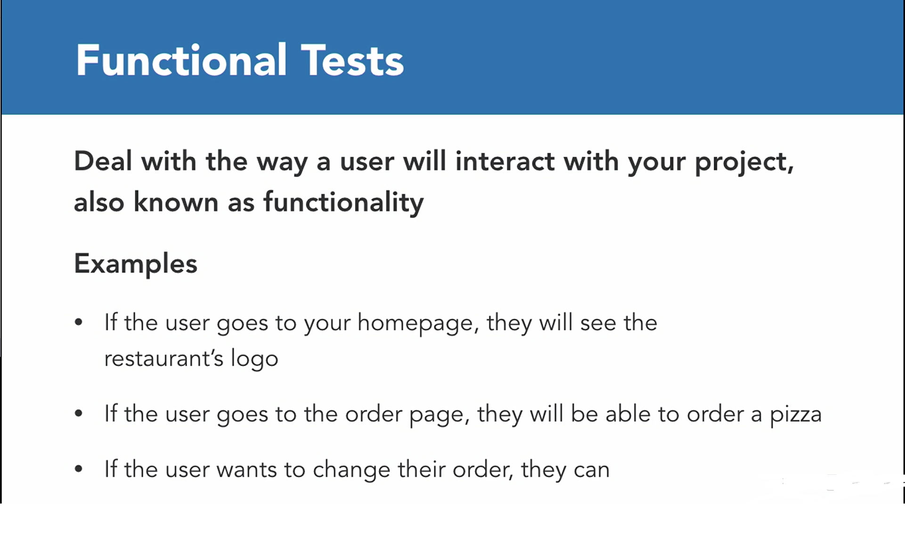
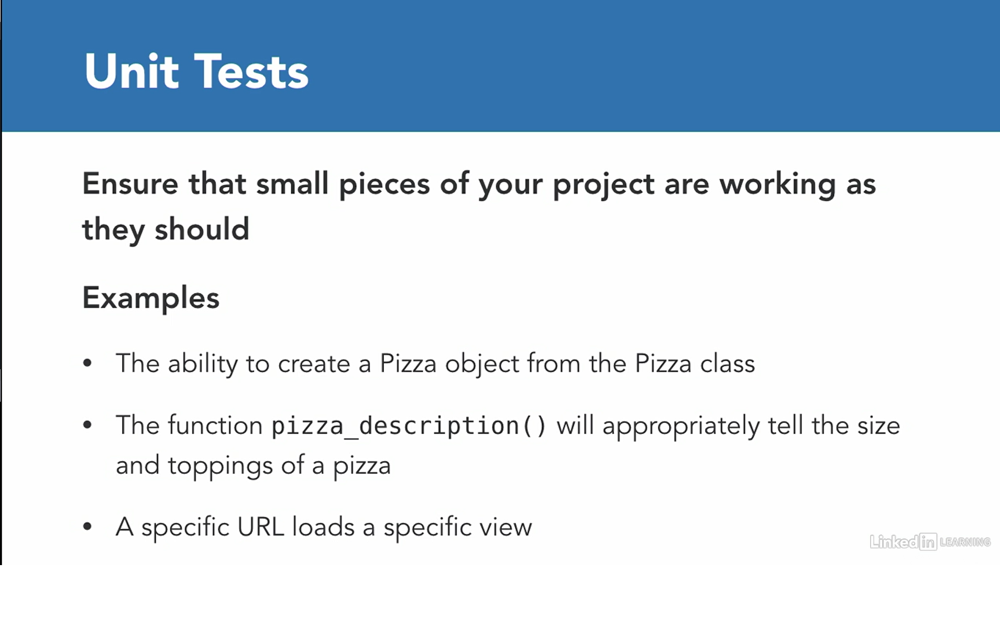
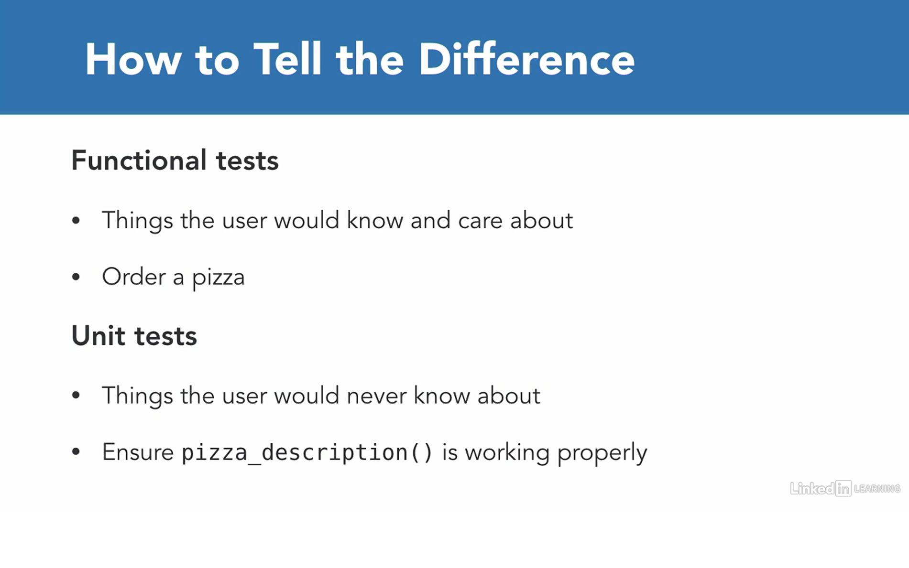

# Django Class Notes

Django Testing

### Nice to have VSCode Extentions

- Djaneiro - Django Snippets  (Be carefull about other conflicting extentions!)

### Needs

- Python (add the path environment variable while installing)
- pip
- virtualenv
- selenium
- firefox browser (manually install)
- geckodriver for firefox (install, unzip)
- chrome browser (Optional)
- chromedriver for chrome (install, unzip)(Optinonal)

### Summary

- Django Testing
- Create project
  - Secure your project
- Testing Example
- Create app
- Hashing
- Functional test
  - Test homepage
  - Test sample hash result
- Unit Test
  - Test homepage
  - Test the form
  - Assertions
  - Test Models & Databases
    - Seperate testing database
  - Test the ability to see a hash on the page
- Combine Unit tests with functional tests
- Deployment testing
- TDD vs. Testing After
- Next steps

### Functional and Unit Tests







### Django Testing

https://docs.djangoproject.com/en/3.2/topics/testing/

Automated testing is an extremely useful bug-killing tool for the modern Web developer. You can use a collection of tests – a test suite – to solve, or avoid, a number of problems:

- When you’re writing new code, you can use tests to validate your code works as expected.
- When you’re refactoring or modifying old code, you can use tests to ensure your changes haven’t affected your application’s behavior unexpectedly.

Testing a Web application is a complex task, because a Web application is made of several layers of logic:

- HTTP-level request handling,
- form validation,
- processing,
- template rendering.

With Django’s test-execution framework and assorted utilities, you can simulate requests, insert test data, inspect your application’s output and generally verify your code is doing what it should be doing.

An easy selenium functional test creation is possible, it's possible to record actions:
https://www.selenium.dev/selenium-ide/

To dive deep into selenium testing wiht python:
https://selenium-python.readthedocs.io/getting-started.html

# Create project

- Shorten your powershell terminal prompt:
```sh
Function Prompt { "MyCode: " }
```
- Create a working directory, name it as you wish, cd to new directory
- Create virtual environment as a best practice:
```py
python3 -m venv env # for Windows or
python -m venv env # for Windows
virtualenv env # for Mac/Linux or;
virtualenv env -p python3 # for Mac/Linux
```
- Activate scripts:
```bash
.\env\Scripts\activate  # for Windows
source env/bin/activate  # for MAC/Linux
```
- See the (env) sign before your command prompt.
- Install django:
```bash
pip install django
```
- Install selenium
```py
pip install selenium
```

### Drivers

Selenium requires a driver to interface with the chosen browser. Firefox, for example, requires geckodriver, which needs to be installed before the below examples can be run. Make sure it’s in your PATH, e. g., place it in /usr/bin or /usr/local/bin. In this example, we will use Firefox.

- How to install Firefox:
https://www.mozilla.org/en-US/firefox/new/

Failure to observe this step will give you an error selenium.common.exceptions.WebDriverException: Message: ‘geckodriver’ executable needs to be in PATH.

Other supported browsers will have their own drivers available. Links to some of the more popular browser drivers follow.

- Chrome:	https://sites.google.com/a/chromium.org/chromedriver/downloads
- Edge:	https://developer.microsoft.com/en-us/microsoft-edge/tools/webdriver/
- Firefox:	https://github.com/mozilla/geckodriver/releases
- Safari:	https://webkit.org/blog/6900/webdriver-support-in-safari-10/

(Optional)
- Go to:
https://sites.google.com/a/chromium.org/chromedriver/downloads
- How to check your version of Chrome:
  - On your computer, open Chrome.
  - At the top right, look at More.
  - Click Help > About Chrome.
- Click the link according to your chrome version
- Install driver according to your OS
- Unzip downloaded file,
- Put chromedriver.exe inside /env/bin/ for mac, linux or /env/Sripts/ for windows.

###  Install geckodriver
- Go to:
https://github.com/mozilla/geckodriver/releases
- Scroll down,
- Download suitable version,
- Unzip downloaded file,
- Put geckodriver.exe inside /env/bin/ for mac, linux or /env/Sripts/ for windows.

- Write your first test, name it test.py on your working directory:
```py
from selenium import webdriver

browser = webdriver.Firefox()
# browser = webdriver.Chrome()
browser.get('http://localhost:8000')

assert browser.page_source.find("install")
```
- Run test
```py
python test.py
```
- See its failing and we need a running django project
- See installed packages:
```sh
pip freeze

# you will see:
asgiref==3.4.1
Django==3.2.6
pytz==2021.1
selenium==3.141.0
sqlparse==0.4.1
urllib3==1.26.6

# If you see lots of things here, that means there is a problem with your virtual env activation. 
# Activate scripts again
```
- Create requirements.txt same level with working directory, send your installed packages to this file, requirements file must be up to date:
```py
pip freeze > requirements.txt
```

- Create project:
```py
django-admin startproject testing . 
# With . it creates a single project folder.
# Avoiding nested folders
```
- Various files has been created!
- Check your project if it's installed correctly:
```py
python manage.py runserver
py -m manage.py runserver
```

# Secure your project (Optional)

### .gitignore

Add standard .gitignore file to the project root directory. 

Do that before adding your files to staging area, else you will need extra work to unstage files to be able to ignore them.

### python-decouple

- To use python decouple in this project, first install it:
```py
pip install python-decouple
```
- For more information: https://pypi.org/project/python-decouple/
- Import the config object on settings.py file:
```py
from decouple import config
```
- Create .env file on root directory. We will collect our variables in this file.
```py
SECRET_KEY = o5o9...
```
- Retrieve the configuration parameters in settings.py:
```py
SECRET_KEY = config('SECRET_KEY')
```
- Now you can send you project to the github, but be sure you added a .gitignore file which has .env on it.

- Add decouple to requirements list, do that every time you install something to your env.
```py
pip freeze > requirements.txt
```

## Testing Example

- After creating the project run the test again. Use second terminal, we need the server up and running
- Run the test again:
```py
python test.py
```
- If no error message is shown on the terminal it means everything is ok.
- But we want to see some info message about the test result as feedback.

# Create app

- Start app
```py
python manage.py startapp hashing
```
- Go to settings.py and add the app to the INSTALLED_APPS:
```py
'hashing'
```
- See the section of tests.py
- Copy our existig test to here.

- Need to create a class, we will seperate functional tests and unit tests

```py
from django.test import TestCase
from selenium import webdriver

# End it with TestCase, nothing special with the prefix name
class FunctionalTestCase(TestCase):

    # Before the test run
    # We want the browser become ready
    # The setUp is part of initialization, this method will get called before every test function which you are going to write in this test case class. Here you are creating the instance of Firefox WebDriver.
    def setUp(self):
        self.browser = webdriver.Firefox()

    # Between, write your test
    # Give a descriptive name
    # This is the test case method. The test case method should always start with characters test.
    def test_there_is_homepage(self):
        self.browser.get('http://localhost:8000')
        self.assertIn('install',self.browser.page_source)

    # After the test run
    # The tearDown method will get called after every test method. This is a place to do all cleanup actions. In the current method, the browser window is closed. You can also call quit method instead of close. The quit will exit the entire browser, whereas close will close a tab, but if it is the only tab opened, by default most browser will exit entirely.
    def tearDown(self):
        self.browser.quit()
```
- Time to test!

The default startapp template creates a tests.py file in the new application. This might be fine if you only have a few tests, but as your test suite grows you’ll likely want to restructure it into a tests package so you can split your tests into different submodules such as test_models.py, test_views.py, test_forms.py, etc. Feel free to pick whatever organizational scheme you like.

Test discovery is based on the unittest module’s built-in test discovery. By default, this will discover tests in any file named “test*.py” under the current working directory.

You can specify particular tests to run by supplying any number of “test labels” to ./manage.py test. Each test label can be a full Python dotted path to a package, module, TestCase subclass, or test method. For instance:
```
# Run all the tests in the animals.tests module
$ ./manage.py test animals.tests

# Run all the tests found within the 'animals' package
$ ./manage.py test animals

# Run just one test case
$ ./manage.py test animals.tests.AnimalTestCase

# Run just one test method
$ ./manage.py test animals.tests.AnimalTestCase.test_animals_can_speak
```

```py
python manage.py test
```

### class TestCase

This is the most common class to use for writing tests in Django. If your Django application doesn’t use a database, use SimpleTestCase.

More information about [Provided test case classes](https://docs.djangoproject.com/en/3.2/topics/testing/tools/#provided-test-case-classes)

## Hashing

Look for Sha256 hashing generator sites. "hello" results the same hash. Case sensitive and if we add anything the hash will change. We will create similar page. 256 bits would represent 64 hex characters

Hashin really important, used in cryptocurrency etc.

First write your test!

### Functional test

```py
from django.test import TestCase
from selenium import webdriver


class FunctionalTestCase(TestCase):


    def setUp(self):
        self.browser = webdriver.Firefox()


    def test_there_is_homepage(self):
        self.browser.get('http://localhost:8000')
        # Instead of django welcom page, we will have
        # a sentence about hash, need to searc for this text
        self.assertIn('Enter hash here:',self.browser.page_source)

    # Add a second test to find hash of corresponding text
    # which is "hello" and its hash
    # this will test if we generate right hash or not
    # In django, any function starting with test runs as a test
    def test_hash_of_hello(self):
        self.browser.get('http://localhost:8000')
        # Find the element with id "text"
        text = self.browser.find_element_by_id("id_text")
        # Simulate user types "hello"
        text.send_keys("hello")
        # Simulate click to the submit button
        self.browser.find_element_by_name("submit").click()
        # Result must be the correct walue
        self.assertInHTML('2cf24dba5fb0a30e26e83b2ac5b9e29e1b161e5c1fa7425e73043362938b9824', self.browser.page_source)


    def tearDown(self):
        self.browser.quit()
```
- Run the test again
```py
python manage.py test
```
- One fail and one error

# Write Unit Tests

## Test home page

Some programmers follow a discipline called “test-driven development”; they actually write their tests before they write their code.  This might seem counter-intuitive, but in fact it’s similar to what most people will often do anyway: they describe a problem, then create some code to solve it.

```py
from django.test import TestCase
from selenium import webdriver


# class FunctionalTestCase(TestCase):
#
#
#     def setUp(self):
#         self.browser = webdriver.Firefox()
#
#
#     def test_there_is_homepage(self):
#         self.browser.get('http://localhost:8000')
#         self.assertIn('Enter hash here:',self.browser.page_source)
#
#
#     def test_hash_of_hello(self):
#         self.browser.get('http://localhost:8000')
#         text = self.browser.find_element_by_id("text")
#         text.send_keys("hello")
#         self.browser.find_element_by_name("submit").click()
#         self.assertIn('2cf24dba5fb0a30e26e83b2ac5b9e29e1b161e5c1fa7425e73043362938b9824', self.browser.page_source)
#
#
#     def tearDown(self):
#         self.browser.quit()

class UnitTestCase(TestCase):


    def test_home_homepage_tempalte(self):
        # Go to the homepage
        response = self.client.get('/')
        # Search for home.html
        self.assertTemplateUsed(response, 'hashing/home.html')
```
- Run the test again
```py
python manage.py test
```
- This will be quick, no openning browser

- Now its time to make these tests passing

### Create url of project

- Go to the urls.py on project, add a new path
```py
from django.contrib import admin
from django.urls import path, include

urlpatterns = [
    path('admin/', admin.site.urls),
    path('', include('hashing.urls')),
]
```

### Create url of app

- Create urls.py on app
```py
from django.urls import path
from .views import home

urlpatterns = [
    path('', home, name='home'),
]
```

### Create View

- Go to views.py in app
- Create home view by adding:
```py
from django.shortcuts import render

def home(request):    
    return render(request, "hashing/home.html")

```

### Create an HTML template

- Create hashing/templates/hashing directory and create a home.html file under it:
```html
<h1>This is the home page!</h1>
```

- Run the test again
```py
python manage.py test
```
- Ok, we have the test passing.


## Test the form

```py
from django.test import TestCase
from selenium import webdriver


# This doesn't exists, will create
from .forms import HashForm

# class FunctionalTestCase(TestCase):
#
#
#     def setUp(self):
#         self.browser = webdriver.Firefox()
#
#
#     def test_there_is_homepage(self):
#         self.browser.get('http://localhost:8000')
#         self.assertIn('Enter hash here:',self.browser.page_source)
#
#
#     def test_hash_of_hello(self):
#         self.browser.get('http://localhost:8000')
#         text = self.browser.find_element_by_id("text")
#         text.send_keys("hello")
#         self.browser.find_element_by_name("submit").click()
#         self.assertIn('2cf24dba5fb0a30e26e83b2ac5b9e29e1b161e5c1fa7425e73043362938b9824', self.browser.page_source)
#
#
#     def tearDown(self):
#         self.browser.quit()

class UnitTestCase(TestCase):


    def test_home_homepage_tempalte(self):
        response = self.client.get('/')
        self.assertTemplateUsed(response, 'hashing/home.html')

    # There should be a form the user enters a text to 
    # find corresponding hash
    def test_hash_form(self):
        # Check if there is a form, needs to filled with some data, for not to be an empty form which basically equals to False
        form = HashForm(data={'text': 'hello'})
        # Check if it is valid
        self.assertTrue(form.is_valid())
```
- Don't forget to import HashForm from forms.py in test.py.
- Run the test again
```py
python manage.py test
```
- Assuming you can't remember how to test a form in django, search for that:
```
how to test if there is a form in django
```
and look for the results, especially results with stackoverflow!

- Have an error as we expected

### Create form

- Create forms.py under app

```py
from django import forms

class HashForm(forms.Form):
    # Using Textarea because some people enters lots of things here, like a paragraph
    text = forms.CharField(label='Enter hash here:', widget=forms.Textarea)
```
- Add our form to the views to put it in the template
- Go to the views.py
```py
from django.shortcuts import render
from .forms import HashForm

def home(request):
    form = HashForm()
    context = {
        'form': form
    }  
    return render(request, "hashing/home.html", context)
```
- Update template to show our form
- Go to home.html
```html
<h1>This is the home page!</h1>

<form action="" method="post">

    

    {{ form.as_p }}

    <input name="submit" type="submit" value="Hash">

</form>
```

- Run the test again
```py
python manage.py test
```
- Passed two tests!

## Test for Assertions

- Using django test, we can create assertions to check our result to the correct output. This will ensure our result is true.

- For more info about assertions on django:
https://docs.djangoproject.com/en/3.2/topics/testing/tools/#assertions

- Now add a test for assertion for the word 'hello' and the equivelent hash. Go to tests.py:
```py
import hashlib


def test_hash_func_works(self):
        # Need to import haslib library to generate hash
        text_hash = hashlib.sha256('hello'.encode('utf-8')).hexdigest()
        # hash.hexdigest() Like digest() except the digest is returned as a string object of double length, containing only hexadecimal digits. This may be used to exchange the value safely in email or other non-binary environments.
        # Info about hashlib: https://docs.python.org/3/library/hashlib.html
        # Check our result equals to the true one
        # Go to any of the website to generate hash
        self.assertEqual('2cf24dba5fb0a30e26e83b2ac5b9e29e1b161e5c1fa7425e73043362938b9824', text_hash)
        # No need to write extra code for that, because it checks the library of hashlib only.
```
- Run the test again
```py
python manage.py test
```
- Passed two tests!

### Test Models & Databases

- Let's create a database testing. Assume that users can save their hashes to share/use later on. First need to create a model:

```py
from django.db import models

class Hash(models.Model):
    text = models.TextField()
    # hash is exactly 64 char long!
    hash = models.CharField(max_length=64)
```

- Need to migrate, after make any change on models
```py
python manage.py makemigrations
# See model Hash is being created

# Send model change to the admin dashboard
python manage.py migrate
```
- To pass this model to admin page, go to admin.py and add:
```py
from hashing.models import Hash
from django.contrib import admin

admin.site.register(Hash)
```
- And modify the model to see better name:
```py
    def __str__(self) -> str:
        return self.text + ' ' + self.hash 
```

- Now we have a model, time to test it
- Turn back to the tests.py
```py
from .models import Hash

def test_hash_object(self):
        # First create a hash object:
        hash = Hash()
        # the first property will be a sample text, and second will be the corresponding hash value of that text
        hash.text = 'hello'
        hash.hash = '2cf24dba5fb0a30e26e83b2ac5b9e29e1b161e5c1fa7425e73043362938b9824'
        # save new test properties to the db
        hash.save()
        # Get the object from db, django will search for this hash from the db, and bring us the object
        pulled_hash = Hash.objects.get(hash='2cf24dba5fb0a30e26e83b2ac5b9e29e1b161e5c1fa7425e73043362938b9824')
        # Check if the db value is equal to the true one
        self.assertEqual(hash.text,pulled_hash.text)
```

### Seperate testing database

- Even in development db, need to isolate testing db, not to mess up with the development db.
- Go to the settings.py
- Add test db under DATABASES, copy from previous db, change it, and add:
```py
'TEST_NAME': BASE_DIR / 'test_db.sqlite3',
```
- In this way, anytime we initialize a test on db, django will create a test db and destroy it after test.

### Saving Model

- User will pass us some information using form, so go to the views.py and add the model to our view:
```py
from .models import Hash
import hashlib

def home(request):
    if request.method == 'POST':
        filled_form = HashForm(request.POST)
        if filled_form.is_valid():
            text = filled_form.cleaned_data['text']
            text_hash = hashlib.sha256(text.encode('utf-8')).hexdigest()
            try:
                # If this object already exists, no need to save it again
                Hash.objects.get(hash=text_hash)
            # If there is no object for the text, need to create an object:
            except Hash.DoesNotExist:
                hash = Hash()
                hash.text = text
                hash.hash = text_hash
                hash.save()
    form = HashForm()
    context = {
        'form': form
    }
    return render(request, 'hashing/home.html', context)
```
- Run the test again
```py
python manage.py test
```
- Write some text on home page and check admin panel if it is saved!

### Test the ability to see a hash on the page
When user enters a text to see the corresponding hash, the page will be redirected to a new one to show the hash. We didn't created this yet.

- First write the test:
```py
    def test_viewing_hash(self):
        # Inherit from Hash form:
        hash = Hash()
        # sample text will be 'hello' as always:
        hash.text = 'hello'
        # sample hash is the same as always
        hash.hash = '2cf24dba5fb0a30e26e83b2ac5b9e29e1b161e5c1fa7425e73043362938b9824'
        # save to the test db
        hash.save()
        # the url pattern should be as fallows, hash/<hash value>
        response = self.client.get('/hash/2cf24dba5fb0a30e26e83b2ac5b9e29e1b161e5c1fa7425e73043362938b9824')
        self.assertContains(response,'hello')
```
- You can update your code combining occurrencies of saveHash(Optional):
```py
def saveHash(self):
        hash = Hash()
        hash.text = 'hello'
        hash.hash = '2cf24dba5fb0a30e26e83b2ac5b9e29e1b161e5c1fa7425e73043362938b9824'
        hash.save()
        return hash

    def test_hash_object(self):
        hash = self.saveHash()
        pulled_hash = Hash.objects.get(hash='2cf24dba5fb0a30e26e83b2ac5b9e29e1b161e5c1fa7425e73043362938b9824')
        self.assertEqual(hash.text,pulled_hash.text)

    def test_viewing_hash(self):
        hash = self.saveHash()
        response = self.client.get('/hash/2cf24dba5fb0a30e26e83b2ac5b9e29e1b161e5c1fa7425e73043362938b9824')
        self.assertContains(response,'hello')
```
- Run the test again
```py
python manage.py test
```
- It fails because we haven't modified our template yet.
- Add the url to the list off app urls.py:

```py
from django.urls import path
# Don't forget to import hash view:
from .views import home, hash

urlpatterns = [
    path('', home, name='home'),
    path('hash/<str:hash>', hash, name="hash"),
]
```
- Next we need to create view:

```py
# This includes hash object also, which we defined in the url:
def hash(request, hash):
    hash = Hash.objects.get(hash=hash)
    return render(request, 'hashing/hash.html', {'hash':hash})
```
- Add a redirect after the save() of home page. If someone send us a valid post request, we will redirect the user to the hash page after saving the value to the db! Don't forget to import redirect:

```py
from django.shortcuts import render, redirect

return redirect('hash', hash=text_hash)
```

- Create hash.html

```html
<h2>Hash:</h2>
<h1>{{ hash.hash }}</h1>
<h2>Text:</h2>
{{ hash.text }}
<h3><a href="">Home</a></h3>
```
- Run the test again

```py
python manage.py test
```
- It passes!

# Combine Unit tests with functional tests

- Uncomment functional test, run the test again, and see the overall result.
```py
python manage.py test
```

### User input with functional tests(Optional)

- We need to test things going wrong. Let's test if we prowide a hash which is too long!

```py
from django.core.exceptions import ValidationError

# Under unit tests add this test:
def test_bad_data(self):
        def badHash():
            hash = Hash()
            hash.hash = '2cf24dba5fb0a30e26e83b2ac5b9e29e1b161e5c1fa7425e73043362938b9824ggggg'
            hash.full_clean()
        # We expect that will raise a validation error
        self.assertRaises(ValidationError, badHash)
```

### Waiting, and ajax (Optional)

Sometimes, we need to wait for some response. Let's add a functional test to explain this topic.
```py
import time

def test_hash_ajax(self):
        self.browser.get('http://localhost:8000')
        self.browser.find_element_by_id('id_text').send_keys('hello')
        time.sleep(2)
        self.assertIn('2cf24dba5fb0a30e26e83b2ac5b9e29e1b161e5c1fa7425e73043362938b9824',self.browser.page_source)
```
- Add ajax, this is a new url, add urls.py under app:
```py
from .views import home, hash, quickhash

path('quickhash', quickhash, name='quickhash'),
```

- Add new view:
```py
from django.http import JsonResponse

def quickhash(request):
    text = request.GET['text']
    return JsonResponse({'hash':hashlib.sha256(text.encode('utf-8')).hexdigest()})
```
- Modify home page an add some css:
```html
<h2 id="quickhash"></h2>


<script src="https://ajax.googleapis.com/ajax/libs/jquery/3.3.1/jquery.min.js"></script>
<script>
    $('#id_text').keyup(function () {
      var text = $(this).val();


      $.ajax({
        url: '/quickhash',
        data: {
          'text': text
        },
        dataType: 'json',
        success: function (data) {
          $('#quickhash').text(data['hash']);
        }
      });


    });
  </script>
```

- Install jquerry googleapi:
https://developers.google.com/speed/libraries

- Copy:
```
jQuery
3.x snippet:
<script src="https://ajax.googleapis.com/ajax/libs/jquery/3.6.0/jquery.min.js"></script>
```

- Check the page if it shows quickhash.
- Run the test again

```py
python manage.py test
```
- It passes!

## Deployment testing

- Run your functional and unit tests locally
- Deploy your code to a staging server, this is not a live server, it is seperate from production.
  - Have a custom domain for that
  - Run your functional tests againist staging site and your unit tests againist staging server.
- Push your code to production
- Automate the process, every time you deploy a new code, this process will run again and again

## TDD vs. Testing After

- Tests can take away joy, speed, and motivation
- When a project is young, it changes too much for testing
  - You will often delete features, and tests associated to them
  - If others aren't using it, why test?
- When adding tests later:
  - Wait until you have version 1.0
  - Create tests for those things you find crucial

## Next steps
- Look at selenium recorder
- Look at code coverage tools
- Try tests on your own projects
- Deploy you code
- Learn deployment automation, ansible etc.