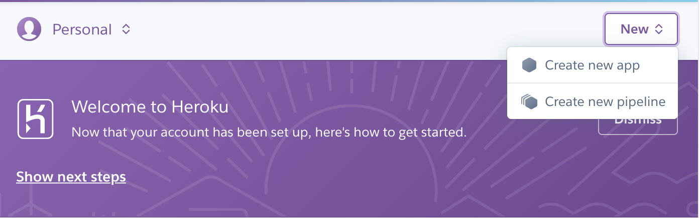
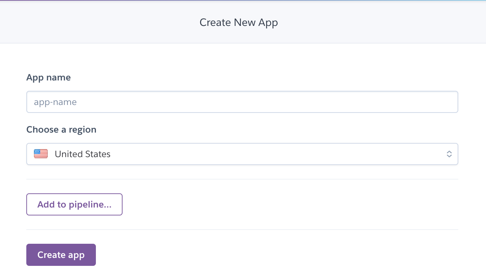
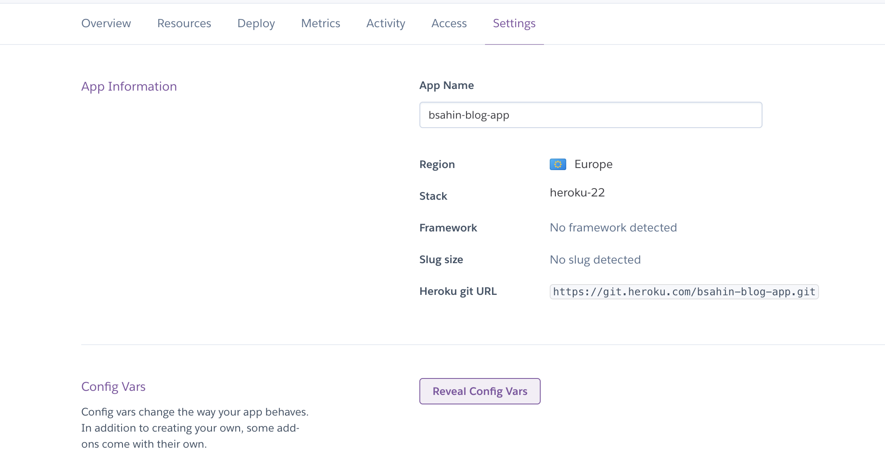
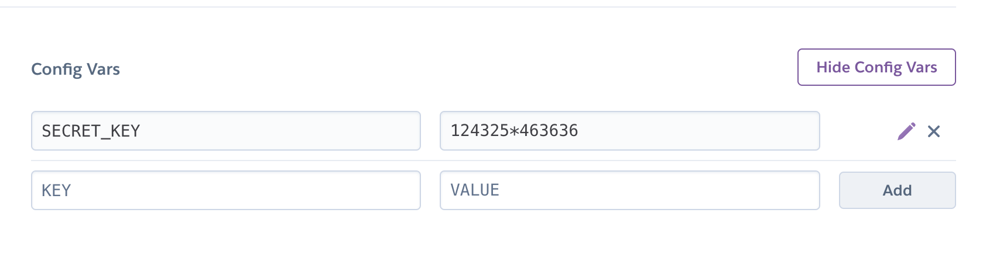
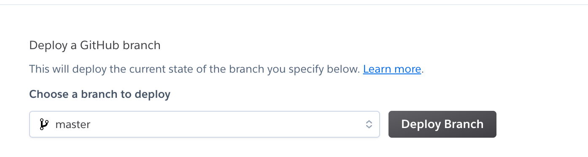
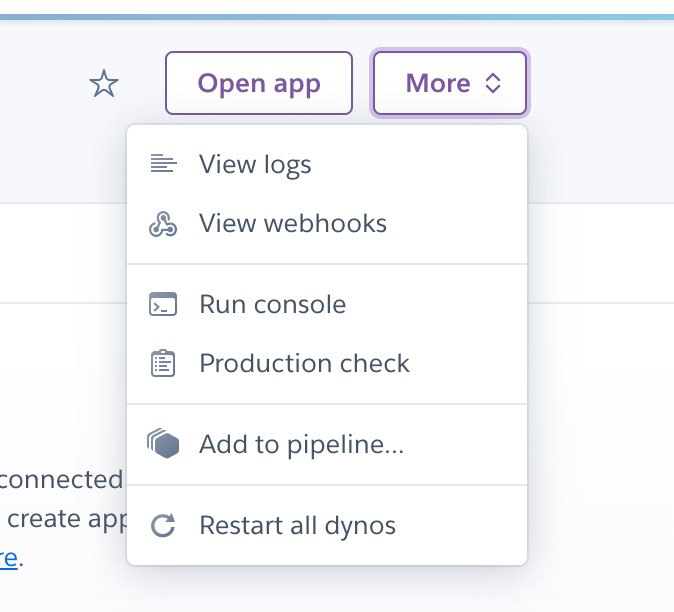

### HEROKU DEPLOY AŞAMALARI:

Heroku web projelerini barındırmak için hosting hizmeti vermektedir.

Localde çalışmış olduğumuz projenin son versiyonunu Github’a push edilmesi gerekmektedir.

Heroku’da hesabımız yoksa bir hesap oluşturmamız gerekiyor.

Şimdi proje dosyasında bazı değişikler yapacağız ve yapılan değişiklikleri Github’a push edeceğiz.

<span style="color:red;font-size:1.5rem" >1.adım: </span><br>
Django projesinde manage.py file ile aynı dizinde Procfile isimli file oluşturuyoruz.
Procfile =>file içerisine
```
web: gunicorn main.wsgi
```
buradaki main djangodaki oluşturduğumuz proje (django-admin startproject main .) ismi ile aynı olacak

<span style="color:red;font-size:1.5rem" >2.adım: </span><br>
İkici aşamamızda  **``` pip install gunicorn ```** paketinin kurulumunu yapıyoruz.

<span style="color:red;font-size:1.5rem" >3.adım: </span><br>
WhiteNoise: Radically simplified static file serving for Python web apps
[whitenoise gitmek için tıkla](http://whitenoise.evans.io/en/stable/) statik dosyaların yönetimini sağlar.Statik files deploy aşamasından sonra görmek istiyorsak;
settings.py içerisine;
```
STATIC_URL='/static/'
#STATIC_ROOT = os.path.join(BASE_DIR, ‘staticfiles’)
STATIC_ROOT = BASE_DIR / "staticfiles"

#Extra places for collectstatic to find static files
STATICFILES_DIRS = ( os.path.join(BASE_DIR, ‘static’), ) # localdeki işlemler için
```
<span style="color:red;font-size:1.5rem" >4.adım: </span><br>
Bu aşamamızda  **``` pip install whitenoise ```** paketinin kurulumunu yapıyoruz.

<span style="color:red;font-size:1.5rem" >5.adım: </span><br>
settings.py file içinde MIDDLEWARE da en üste aşağıdaki kodu yazıyoruz.
```
MIDDLEWARE = [
    # ...
    "django.middleware.security.SecurityMiddleware",
    "whitenoise.middleware.WhiteNoiseMiddleware",
    # ...
]
```
<span style="color:red;font-size:1.5rem" >6.adım: </span><br>
WhiteNoise, dosyalarınızı otomatik olarak sıkıştırmayı ve sonsuza kadar güvenle önbelleğe alınabilmeleri için her sürüm için benzersiz adlar oluşturmayı üstlenen bir depolama arka ucuyla birlikte gelir. Kullanmak için bunu settings.py'nize eklemeniz yeterlidir:settings.py file da sayfanın en alt kısmına aşağıdaki kodu yazıyoruz,
```
STATICFILES_STORAGE = ‘whitenoise.storage.CompressedManifestStaticFilesStorage’

```
<span style="color:red;font-size:1.5rem" >7.adım: </span><br>
Herokuda django paketlerinin kurulabilmesi için;
settings.py file da
- import django_heroku ,
- **pip install django-heroku** paketini yüklüyoruz,
### NOT: Eğer macOS işletim sistemi kullanıyorsanız bu komut pip install django-on-heroku şeklinde olacaktır.

settings.py da en alt kısıma aşağıdaki kodu yazıyoruz,
- django_heroku.settings(locals())

- Bu aşamaya kadar olan projedeki değişiklikleri Github repomuza push ediyoruz.

<span style="color:red;font-size:1.5rem" >(8).adım: </span><br>
Login işlemlerinden sonra;
Şimdi [heroku sayfasına gidiyoruz](https://dashboard.heroku.com/apps). <br>
<p> </p>

<span style="color:red;font-size:1.5rem" >(9).adım: </span><br>
Heroku’da login olduktan sonra ana sayfada new/Create new app ile ilerliyoruz,
Unique bir appname oluşturuyoruz. <br><br>
<p> </p>
<br><br>
<p> </p>

Projemize isim verdikten sonra create app ile devam ediyoruz, üç adet deploy methodu ile devam edilebilmektedir. Github seçtikten sonra heroku ile github arasından bağlantı kuruluyor, Github hesabınızdan heroku için onay veriyoruz.


<span style="color:red;font-size:1.5rem" >10.adım: </span><br>
## Config Vars

Ancak githubla bağlantı kurmadan önce  env dosyası gitignore edildiğinden içerisindeki SECRET_KEY mevcut değil.Herokuda verileri github üzerinden çekeceğinden .env file dosyasını okuyamayacak.


//Config Vars
Settings tıklayarak Reveal Config Vars sekmesine geliyoruz.

Config Vars içerisinde SECRET_KEY yazıyoruz.Ana dosyamızdaki secret key ile aynı olmak zorunda değildir.
<p> </p>
<p> </p>
<br><br>

//github authorize
Şimdi github ile bağlantı kuruyoruz.Heroku ile github authorize işlemi yapılmadıysa yapıyoruz.İlgili projemizi seçiyoruz.

<span style="color:red;font-size:1.5rem" >11.adım: </span><br>

## deploy branch
Heroku ile Github arasında bağlantı kurulduktan sonra sayfanın alt kısmında github reposundan ilgili proenizi ismi ile arayıp buluyoruz. Projeyi deploy edeceğiniz branch seçiyoruz ve deploy branch butonu ile projeyi herokuya gönderiyoruz.
<p> </p>

<span style="color:red;font-size:1.5rem" >12.adım: </span><br>
# run console
Bu aşamda projenin build işlemini hatasız olarak tamamlıyoruz, artık projemiz canlıda, son bir işlemimiz kalıyor;

django models.py da bulanan tablolarımızı yeni databasemize kayıt etmemiz gerekiyor bu işlem yapılmazsa proje çalışmayacaktır

run console ile python manage.py migrate komutunu çalıştırıyoruz. Artık models.py da ki tablolarınız yeni database kayıt edildi.

<p> </p>
 Django uygulamanızı heroku ya başarılı bir şekilde deploy ettik…